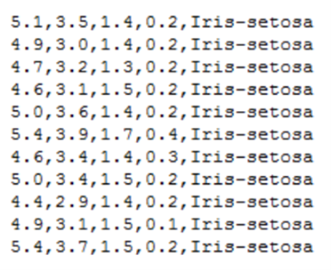
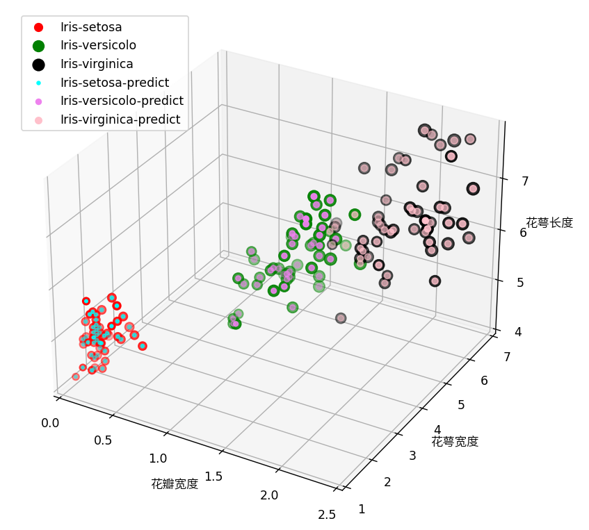

# 机器学习鸢尾花分类

## 一、实验目的
1. 鸢尾花分类实验的实验目的是探究机器学习算法在分类问题上的应用，比较不同算法的性能和优缺点，提高对机器学习原理和方法的理解和掌握。鸢尾花数据集是一个经典的多分类数据集，包含三种鸢尾花（山鸢尾、变色鸢尾和维吉尼亚鸢尾）的150个样本，每个样本有四个特征（花萼长度、花萼宽度、花瓣长度、花瓣宽度）。通过对这些特征进行分析，可以建立机器学习模型来预测新的鸢尾花属于哪一种类别。
2. 在本实验中，我们将使用感知机、K近邻、决策树、支持向量机等常用的机器学习算法来对鸢尾花数据集进行分类，并评估各个算法的准确率、召回率、F1值等指标，以及算法的优缺点和适用场景。
3. 这个实验可以帮助学我们理解并掌握机器学习的完整过程，包括数据预处理、模型训练、模型评估、模型优化等。了解不同的机器学习算法的原理和使用场景，以及它们在分类问题上的优缺点。学习使用Python或其他编程语言实现机器学习算法，并进行可视化展示。
## 二、原理分析
SVM的基本思想是在特征空间中寻找一个最优的超平面，使得两类数据之间的间隔最大，从而提高分类性能。它通过引入拉格朗日乘子和对偶问题，将原始问题转化为一个凸二次规划问题，并通过KKT条件求解最优解。SVM的扩展模型是线性支持向量机和非线性支持向量机，它们分别通过引入松弛变量和核函数技巧，来处理线性不可分和非线性的情况。SVM的参数选择和优化方法有交叉验证、网格搜索、梯度下降、群智能算法等，它们可以帮助寻找最佳的正则化系数C和核函数参数g。

支持向量机可以从以下几个方面进行：
1. 线性可分支持向量机:当训练集中的样本是线性可分的，即存在一个超平面可以将不同类别的样本完全分开，那么支持向量机的目标是找到一个间隔最大的超平面，即使得距离超平面最近的样本点（称为支持向量）到超平面的距离最大。这个问题可以转化为一个凸二次规划问题，并通过拉格朗日对偶方法求解。

2. 线性支持向量机:当训练集中的样本是线性不可分的，即不存在一个超平面可以将不同类别的样本完全分开，那么支持向量机需要允许一些样本点出现在间隔内部或者错误分类，这时候需要引入松弛变量和惩罚参数来度量误分类程度，并且使得间隔加上惩罚项最小化。这个问题仍然可以转化为一个凸二次规划问题，并通过拉格朗日对偶方法求解。
3. 非线性支持向量机:当训练集中的样本是非线性可分的，即不存在一个超平面或者超曲面可以将不同类别的样本完全分开，那么支持向量机需要将原始特征空间映射到一个更高维度或者无穷维度的特征空间，在这个新空间中寻找最大间隔超平面。这时候需要引入核函数来计算映射后特征空间中两个点之间的内积，从而避免直接计算映射函数。核函数有多种选择，如多项式核、高斯核、拉普拉斯核等。

SVM算法在鸢尾花数据集上的训练和测试过程，以及模型的评估指标，如准确率、混淆矩阵、ROC曲线，主要包括以下几个步骤：
* 数据理解：鸢尾花数据集是一个经典的多分类数据集，包含了150个样本，每个样本有4个特征（花萼长度、花萼宽度、花瓣长度、花瓣宽度），以及3个类别（山鸢尾、变色鸢尾、维吉尼亚鸢尾）。
* 数据预处理：将数据集分为训练集和测试集，对特征进行归一化或标准化处理，以消除量纲和数值范围的影响。
* 模型训练：使用SVM算法对训练集进行拟合，选择合适的核函数和参数，得到分类超平面和支持向量。
* 模型测试：使用测试集对模型进行评估，计算模型的准确率、混淆矩阵、ROC曲线等指标，反映模型的分类性能和泛化能力。
模型可视化：使用matplotlib等工具对模型的结果进行可视化展示，如绘制特征空间中的超平面、支持向量、决策边界等。

## 三、数据集说明
鸢尾花数据集最初由Edgar Anderson 测量得到，而后在著名的统计学家和生物学家R.A Fisher于1936年发表的文章中被使用，用其作为线性判别分析(Linear Discriminant Analysis)的一个例子，证明分类的统计方法，从此而被众人所知，尤其是机器学习领域。

鸢尾花数据集共收集了三类鸢尾花，即山鸢尾、变色鸢尾和维吉尼亚鸢尾，每一类鸢尾花收集了50条样本记录，共计150条。数据集包括4个属性，分别为花萼的长、花萼的宽、花瓣的长和花瓣的宽。花萼是花冠外面的绿色被叶，在花尚未开放时，保护着花蕾。四个属性的单位都是cm，属于数值变量，四个属性均不存在缺失值的情况。

数据集形式如图所示：

数据集总共包含150行数据，每一行数据由4 个特征值及一个目标值组成。4 个特征值分别为：萼片长度、萼片宽度、花瓣长度、花瓣宽度。目标值为三种不同类别的鸢尾花，分别为：Iris Setosa，Iris Versicolour，Iris Virginica。

## 四、关键程序代码释义

参考本项目的SVM算法代码，[点击打开svm.py]([file:./../svm.py](https://github.com/liuqi34584/iris/blob/main/svm.py))

## 五、结果展示及分析
1. 结果可视化展示四维的鸢尾花分类散点图，并且在最后输出测试的准确率，在实验过程中，测试集的准确率达到了100%，结果如下图：

2. 实验证明SVM在鸢尾花小样本数据集时，具有非常好的表现。SVM可以解决小样本、非线性的回归和二分类问题。找到最优超平面，最大化分类边际，提高泛化能力；在本实验中选择SVM是合适的。
3. SVM算法有两个重要的参数：惩罚系数C和核函数类型和参数。
* 惩罚系数C是用于对误分类的样本进行惩罚，控制了模型的复杂度和泛化能力。C越大，表示对误分类的容忍度越低，模型越复杂，容易过拟合；C越小，表示对误分类的容忍度越高，模型越简单，容易欠拟合。C的选择需要根据数据集的特点和实验效果进行调整。
* 核函数类型和参数是用于将线性不可分的数据映射到高维空间中，使其线性可分。常用的核函数有线性核、多项式核、高斯核（RBF）等。不同类型的核函数有不同的参数，如多项式核有γ、b、d三个参数；高斯核有γ一个参数。核函数类型和参数的选择也需要根据数据集的特点和实验效果进行调整。

## 六、实验过程遇到的问题及解决方案
### 问题：不熟悉百度Ai Studio环境，需要了解paddle的学习框架，编译过程，代码输出方式，版本输出方式。 

* 办法：阅读对应实验的实验要求，同时查阅官方Ai Studio的新手入门教程，完成环境的运行。

### 问题：算法的选择

* 办法：有多种算法可以用于鸢尾花分类，例如神经网络、支持向量机、KNN等。
支持向量机（SVM）是一种常用的分类算法，它的优势主要有以下几点：
SVM可以利用核函数实现非线性映射，处理线性不可分的数据；SVM可以找到最优超平面，最大化分类边际，提高泛化能力；SVM只依赖于支持向量进行分类决策，减少了计算复杂度；SVM可以解决小样本、高维和非线性的回归和二分类问题。
### 问题：SVM参数调制
* 办法：学习到的重要调制方法是，SVM的参数调制主要涉及到两个重要参数：正则化系数C和核函数参数g1。这两个参数的选择会影响SVM的拟合度和泛化能力，一般需要通过交叉验证或者优化算法来寻找最优值。
如果数据量较小，可以选择高斯核函数，否则可以选择线性核函数；
如果数据噪声较大，可以把C调小，否则可以把C调大；
如果数据线性可分，可以把g调大，否则可以把g调小；

